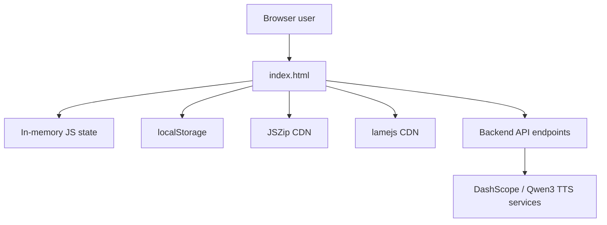

# Current Implementation

## Overview

The app is a static browser UI implemented entirely inside `Narrate_AI_05-26-v2.2/index.html`. There is no bundler, package manifest, test suite, or backend in this repository. The file combines:

- page structure and styling
- feature configuration data
- all browser-side state
- all request orchestration
- download/export helpers

The HTML file is roughly organized as:

- CSS and visual styles: top of file through the main UI styling block
- HTML markup: form controls, cards, audio player, cloning area, demo area, usage table, book UI, and log UI
- JavaScript: voice definitions, state, UI rendering, API calls, preview/demo/export logic, language detection, and cloning logic

## Runtime architecture

Important constraint: the `API` box does not exist in this repository. The frontend assumes it is running behind a compatible server or proxy.

## Repo-level characteristics

| Area | Current state |
| --- | --- |
| App shell | Single HTML file |
| Styling | Inline `<style>` block |
| Logic | Inline `<script>` block |
| Voice catalog | Hard-coded `VOICES` array in JavaScript |
| Pricing model | Hard-coded `PRICING` object in JavaScript |
| Persistence | `localStorage` only |
| Export helpers | Browser Blob APIs, Web Audio API, dynamic CDN scripts |
| Server code | Not present |
| Automated tests | Not present |
| Build/lint tooling | Not present |

## Feature inventory

| Feature | Status | Notes |
| --- | --- | --- |
| API key entry and show/hide toggle | Implemented | Key stays in the input field only; it is not persisted in local storage. |
| Single text-to-speech generation | Implemented | Uses `/synthesize` and expects audio back. |
| Voice picker | Implemented | 48 hard-coded voices with icon, gender, and description metadata. |
| Style presets and custom instructions | Implemented | Only intended for `qwen3-tts-instruct-flash`. |
| Cost estimator | Implemented with gaps | Works for flash and instruct-flash, but cloned-voice handling is incomplete. |
| Usage history | Implemented | Stored in local storage, capped to 200 entries. |
| Voice preview generator | Implemented | Generates a short sample for every built-in voice and can ZIP the results. |
| Demo mode | Implemented | Batch-generates samples across selected voices and can merge outputs into WAV or MP3. |
| Auto language detection | Implemented | Heuristic script and stop-word detection in the browser. |
| Voice cloning UI | Partially implemented | Browser flow exists, but it depends on missing backend endpoints. |
| Book / Script Analyser | UI only | Controls exist, but handler functions are missing. |
| Event Log | UI only | Filter and clear controls exist, but log functions are missing. |

## Major source sections

### 1. Voice and pricing configuration

The script defines:

- `VOICES`: 48 built-in voices with `id`, `gender`, `icon`, and `desc`
- `PRICING`: browser-side price table for `qwen3-tts-flash` and `qwen3-tts-instruct-flash`
- `FREE_QUOTA`: set to `10000`

Observations:

- Built-in voice metadata is hard-coded rather than fetched.
- Pricing is partially hard-coded and does not fully model cloned-voice flows.

### 2. Single-generation flow

Primary function: `generate()`

Behavior:

- reads `api_key`, `text`, `voice`, `language`, `model`, and `instructions`
- POSTs JSON to `/synthesize`
- validates response content type
- reads usage headers `X-Usage-Chars` and `X-Usage-Cost`
- creates a Blob URL for the returned audio
- updates the audio player and download link
- records usage in local storage

Current assumptions:

- success response is audio or octet-stream
- error response is JSON with an `error` field

### 3. Usage and quota tracking

Primary functions:

- `syncFreeUsed()`
- `updateCostEstimate()`
- `recordUsage()`
- `renderUsage()`
- `resetUsage()`

Stored browser keys:

- `qwen3tts_history`
- `qwen3tts_skip_autoload`

Behavior:

- usage history is reconstructed from local storage at boot
- quota display is derived from history instead of being server-authoritative
- totals are shown in a table with call count, chars, and cost

Design limitation:

- quota math is local, heuristic, and can drift from server truth

### 4. Voice demo mode

Primary functions:

- `buildDemoChecklist()`
- `updateDemoInfo()`
- `startDemo()`
- `cancelDemo()`
- `downloadCombined()`

Behavior:

- allows per-voice selection across the hard-coded voice list
- prepends `Hi, my name is {Voice}.` to each sample
- calls `/synthesize` sequentially
- stores each result in `demoAudioBlobs`
- concatenates audio buffers in browser memory
- optionally re-encodes to MP3 through `lamejs`

Trade-offs:

- simple implementation
- slow for large voice batches because requests are sequential
- memory-heavy when stitching many audio files in browser

### 5. Voice preview generation

Primary functions:

- `buildPreviewGrid()`
- `generatePreviews()`
- `playPreview()`
- `downloadPreviewZip()`
- `loadPreviewsFromZip()`
- `loadPreviewsFromFiles()`

Behavior:

- generates a one-line sample for each built-in voice
- caches generated preview blobs in `previewBlobs`
- uses `JSZip` from jsDelivr for ZIP export
- can reload previously saved preview assets from ZIP or file selection

Trade-offs:

- useful for offline comparison once previews are generated
- still depends on live synthesis to create the initial preview set

### 6. Language detection

Primary functions:

- `detectLanguage()`
- `guessLanguage()`

Behavior:

- uses Unicode block counting and common stop-word regex checks
- auto-selects a language option when it can infer a supported language

Limitations:

- heuristic only
- can misclassify mixed-language text
- no confidence score or user override history

### 7. Voice cloning

Primary functions:

- `setCloneFile()`
- `cloneVoice()`
- `loadSavedVoices()`
- `renderSavedVoices()`
- `activateCloneVoice()`
- `deleteCloneVoice()`

Behavior:

- accepts `.wav`, `.mp3`, or `.m4a`
- rejects files over 10 MB on the client side
- uploads `multipart/form-data` to `/clone-voice`
- lists saved cloned voices from `/list-voices`
- deletes them through `/delete-voice`
- switches the model selector to `qwen3-tts-vc-2026-01-22`

Current limitation:

- pricing, quota, and some fallback math do not fully support the cloned-voice model

### 8. Book / Script Analyser

Rendered UI elements exist for:

- pasting long-form text
- separator configuration
- chunk size input
- analysis trigger
- character-to-voice assignment
- generation progress
- ZIP/WAV/MP3 download buttons

Current reality:

- the buttons reference `bookAnalyse()`, `bookGenerate()`, `bookCancel()`, `bookDownloadZip()`, and `bookDownloadCombined()`
- those functions are not defined anywhere in the script
- the feature is a UI shell, not a working workflow

### 9. Event Log

Rendered UI elements exist for:

- level filter
- clear button
- log panel

Current reality:

- `renderLog()` and `clearLog()` are referenced by the UI
- neither function is defined
- there is no in-memory log store or instrumentation layer

## Key browser-side state

| Variable | Purpose |
| --- | --- |
| `selectedVoice` | Currently active voice ID for synthesis |
| `usageHistory` | Local persisted history of generated items |
| `freeUsed` | Derived local quota consumption tracker |
| `speedPreset` / `tonePreset` | UI-side style presets |
| `demoCheckedVoices` | Current voice subset for demo mode |
| `demoAudioBlobs` | Generated demo clips for combined export |
| `previewBlobs` | Generated or imported preview clips per voice |
| `previewCancelled` / `demoCancelled` | Batch cancellation flags |
| `cloneFile` | Selected source file for voice cloning |
| `activeCloneVoiceId` | Current cloned voice selected for synthesis |

## External dependencies

### Hard runtime dependencies

- Browser support for `fetch`, `Blob`, `URL.createObjectURL`, `Audio`, `AudioContext`, and `localStorage`
- network access to the backend endpoints

### Dynamic dependencies loaded at runtime

- `https://cdn.jsdelivr.net/npm/lamejs@1.2.1/lame.min.js`
- `https://cdn.jsdelivr.net/npm/jszip@3.10.1/dist/jszip.min.js`

Risk note:

- MP3 export and ZIP export silently depend on public CDN availability
- there is no lockfile, integrity pinning, or local fallback

## Reference material in repo

The `Narrate_AI_05-26-v2.2/` folder includes downloaded Markdown copies of Alibaba Cloud documentation for:

- Qwen TTS general usage
- request fields
- voice lists
- voice cloning

These files appear to be used as offline reference material for the current prototype rather than as executable project assets.
