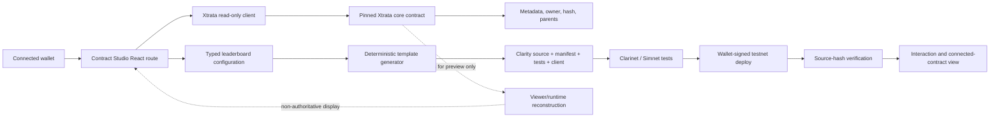

# Xtrata Contract Studio — Phase 0 architecture

Status: repository-derived design baseline, 2026-07-23.

## 1. Concise product understanding

Contract Studio turns an existing Xtrata inscription into the immutable asset
reference for visible, generated Clarity logic. It is not an arbitrary AI code
generator. A user selects and verifies an inscription, chooses a reviewed
versioned template, edits typed configuration, sees the complete deterministic
source and security assumptions, runs the attached tests, exports a Clarinet
project, and signs deployment with a wallet.

The first vertical slice is a Tier 1 leaderboard. Xtrata continues to hold the
game bytes; the generated contract holds score state and a permanent,
on-chain-verifiable reference to the game.

## 2. Repository findings

### Active application

- `xtrata-2.0` is the active release tree. The root branch is `main-staging`.
- The application uses React 18, TypeScript, Vite 5, React Query, and the
  `@stacks/connect`, `@stacks/network`, and `@stacks/transactions` packages.
- `src/main.tsx` is the React route boundary. The effective root public
  homepage is `SimplePublicHome`; `/workspace` uses `PublicApp`; the internal
  product uses `App`.
- `index.html` is also a self-contained public homepage bundle. Contract Studio
  is a distinct tool route, so it does not duplicate its implementation there.
- `src/styles/app.css` is the shared visual system. It provides the Xtrata
  surface, border, ink, accent, network badge, spacing, button, and theme
  variables used by the Studio.
- Wallet requests are centralized in `src/lib/wallet/connect.ts`; persistent
  first-party sessions currently reject testnet in
  `src/lib/wallet/session.ts`. Studio therefore uses an ephemeral wallet
  connection for testnet and never changes the existing mainnet session rule.
- Network endpoint selection and proxy fallback live in
  `src/lib/network/config.ts` and `src/lib/network/stacks.ts`.
- The repository contains Pages Functions, but deployment signing is already
  browser-to-wallet and no deployer secret is required.

### Xtrata inscription protocol

- An inscription is addressed by the pair
  `{ core contract principal, token id }`. A bare numeric id is not globally
  unique across core contract versions.
- `get-inscription-meta(id)` exposes owner, creator, MIME type, total size,
  total chunks, sealed status, and final 32-byte hash.
- `get-owner(id)` returns the current SIP-009 owner.
- `get-parents(id)` and `get-dependencies(id)` return separate immutable
  relationship lists in current v3 cores.
- `get-id-by-hash(hash)` supports hash-to-first-id lookup in current v3.
- Content is reconstructed from on-chain chunks by the viewer/cache/runtime
  layers. A Clarity consumer can query metadata and relationships but should not
  attempt to inspect or interpret arbitrary file bytes.
- Creation follows begin → chunk/batch upload → seal. Relationship-aware seal
  calls validate parents and store parent/dependency lists.
- `src/lib/protocol/types.ts`, `parsers.ts`, and
  `src/lib/contract/client.ts` are the reusable typed read layer.
- `src/lib/viewer/content.ts`, `cache.ts`, `queries.ts`, and the token preview
  components are the existing display/reconstruction layer.

### Existing relevant contracts

- `xtrata-arcade-scores-v1.0` through `v1.3` are present in live, other, and
  Clarinet copies with Clarinet tests. v1.3 is a fee-supported public top-10
  board. It does not pin a governing Xtrata inscription and is therefore a
  reference implementation, not the Studio output unchanged.
- `proof-of-free-living-synth-v1` is the repository’s relevant recording
  registry. It pins an Xtrata core, verifies sealed MIME/size/hash/ownership,
  requires an immutable parent relationship, and stores recording ids rather
  than recording bytes. No general-purpose preset registry was found.
- The Living Synth contract’s `xtrata-core-trait` is the strongest existing
  precedent for safe Xtrata-to-logic linking.
- The current contract inventory and Clarinet project are in
  `docs/contract-inventory.md` and `contracts/clarinet`.

### Confirmed on-chain versus indexed-only data

| Field | Current v3 core | Mutability | Authority |
| --- | --- | --- | --- |
| Core contract principal | chain identity | immutable per reference | on-chain |
| Token id | SIP-009 identifier | immutable | on-chain |
| Final content hash | inscription metadata | immutable after seal | on-chain |
| Creator | inscription metadata | immutable | on-chain |
| Current owner | SIP-009 owner/meta | mutable by transfer | on-chain |
| MIME, size, chunks, sealed | inscription metadata | immutable after seal | on-chain |
| Parents and dependencies | relationship maps | immutable after seal | on-chain |
| Protocol version | `get-contract-info`/registry | core-specific | on-chain plus app registry |
| Inscription deploy/seal tx id | transaction/event history | immutable evidence | indexer |
| Preview, title, labels | reconstructed/indexed content | derived | non-authoritative |
| Connected-contract discovery | events/association records | append-only index | indexed unless approved on-chain |

No repository function proves a token’s original transaction id from only its
token id inside another Clarity contract.

## 3. Proposed system architecture



The generator is a pure SDK-oriented library. The React screen is a consumer,
not the owner of generation rules.

## 4. Definitive inscription-to-contract linking model

### `XtrataAssetRef`

```ts
type XtrataAssetRef = {
  network: 'mainnet' | 'testnet';
  coreContractId: `${string}.${string}`;
  tokenId: string;                 // canonical decimal uint
  contentHash: string;             // lowercase 64-character SHA-256 hex
  creator: string;
  mimeType: string;
  totalSize: string;               // canonical decimal uint
  parents: string[];
  dependencies: string[];
  protocolVersion: string;
};
```

`coreContractId + tokenId` is the primary identity. `contentHash` pins the
expected sealed bytes and detects a counterfeit or wrong-core reference.
Creator/MIME/size/relationships are captured in the public manifest for review,
but a generated contract only stores fields it actively enforces.

The generated contract makes a direct static `contract-call?` to the pinned
core principal. Its initialization/verification call reads
`get-inscription-meta(token-id)`, requires `sealed = true`, requires
`final-hash = expected contentHash`, and records that verification occurred.
There is no caller-supplied core that can be substituted.

Repository validation found that the current v3 `get-inscription-meta` returns
an optional tuple directly. Clarity trait methods require response return
types, so the response-returning trait copied by the Living Synth contract does
not match the current core ABI and is not the canonical Studio mechanism.
Direct static calls are both compatible and stronger. Clarinet tests deploy a
faithful mock under the exact principal/name pinned by the generated fixture.
A generated project is network-specific.

The Studio does not treat transaction ids, previews, indexer titles, or a mere
third-party reference as authority. A future “official connection” should use
an on-chain approval made by the current inscription owner (or creator under a
clearly chosen immutable-creator policy). Unapproved references remain
discoverable community extensions and must be labelled as such.

## 5. User journey

1. Open `/contract-studio`, choose network and the exact Xtrata core.
2. Connect a wallet or use a read-only sender; paste a token id.
3. Read and display metadata, owner, creator, hash, MIME, parents, and
   dependencies from that core. Reject missing or unsealed tokens.
4. Confirm the authoritative reference and distinguish creator, deployer, and
   administrator.
5. Choose “Keep Scores” and edit the typed bounds, ordering, submission,
   duplicate, reset, alias, and top-N policies.
6. Review included/excluded modules, permissions, stored data, limitations,
   upgrade model, and Tier 1 classification.
7. Generate deterministic source and the complete project bundle.
8. Run the visible simulator scenarios and the exported Clarinet tests.
9. Deploy only on the asset’s network with a matching connected wallet.
   Testnet is required before any later Tier 2 flow.
10. Store the deploy transaction, fetch deployed source, compare SHA-256, and
    expose interaction controls. Connected-contract publication requires an
    owner approval design; Phase 1 displays a local verified connection record.

## 6. Template and module architecture

```text
contract-studio/
  model.ts                  canonical manifest and configuration types
  canonical.ts              stable serialization and SHA-256 helpers
  asset-reference.ts        core principal/token validation and reads
  templates/
    leaderboard-v1.ts       reviewed deterministic Clarity template
  generators/
    project.ts              artifacts, manifest, README, TS client, tests
  simulation/
    leaderboard.ts          resettable visual state model
  deployment.ts             source verification and network guards
  export.ts                 deterministic ZIP packaging
```

Templates have a semantic version, typed configuration, explicit compatibility
and risk metadata, source comments, tests, migration notes, and a deterministic
configuration hash. Free text never becomes Clarity source. Editing generated
source marks the project customised and invalidates the test result.

Phase 1 modules:

- `xtrata-asset-ref/1`: pinned core, token id, and hash verification.
- `leaderboard-core/1`: score bounds, direction, player records, ranked reads.
- `submission-policy/1`: public or administrator-authorised submission.
- `season-reset/1`: administrator starts a new season; historical map entries
  remain addressable and no unbounded delete loop is attempted.
- `events/1`: verification, score, and season events for indexing.

## 7. Threat model

| Threat | Control |
| --- | --- |
| Counterfeit core supplied at runtime | direct static call; no runtime core argument |
| Wrong token or mutable display metadata | pin token id and sealed final hash |
| Frontend claims a connection is official | require owner approval for official status; label local/community links |
| Unauthorised score/reset | on-chain role checks; test negative paths |
| Confused deputy via `contract-caller` | user identity and admin checks use `tx-sender`; no forwarded authority |
| Duplicate/replayed score | configured per-wallet record and duplicate policy |
| Invalid/huge score | compile-time min/max constants and uint checks |
| Storage spam | bounded one player record per wallet/season; top-N fixed and small |
| Reset denial of service | increment season rather than iterating/deleting maps |
| Source substitution between test and deploy | SHA-256 recorded before deploy and compared with fetched source |
| Network mismatch | asset, wallet, core, and deploy network must agree |
| Wallet secret theft | only wallet request APIs; no seed/private-key input |
| False audit claim | “tested” and “template-reviewed” only; independent audit remains separate |

Residual risks include dishonest authorised scorers, Sybil wallets for public
boards, misleading player-provided aliases, indexer lag, wallet/provider bugs,
and Clarity/toolchain defects. A public game cannot prove that a submitted score
was honestly earned without a separate attestation or game-verification model.

## 8. Risk tiers

- Tier 1 — registries, counters, non-financial attestations, public or
  authorised scores, and read-only inscription links. Tests and source review
  are mandatory; streamlined deployment is allowed.
- Tier 2 — NFTs, token gating, payments, treasury collection, controlled
  metadata, and sponsored flows. Require asset post-conditions, testnet proof,
  permission/treasury review, and readiness report.
- Tier 3 — custody, escrow, auctions, marketplaces, revenue distribution, and
  upgradeable financial logic. No one-click mainnet deployment in the initial
  product; specialist review is required.

Adding a fee to the Phase 1 leaderboard would move it to Tier 2. The initial
template therefore transfers and holds no assets.

## 9. Phased implementation plan

1. Phase 1: complete the real inscription → generated leaderboard → tests and
   visual simulation → export → wallet testnet deploy/source verification path.
2. Phase 2: extract the stable template registry and add a compact-state versus
   inscription-referenced preset registry, using Living Synth as precedent.
3. Phase 3: add SIP-009 only after standard conformance tests, supply/payment
   invariants, and post-condition generation pass.
4. Phase 4: compatibility-checked composition such as scores + achievements or
   NFT + traits.
5. Phase 5: provenance/access first; financial and custodial modules remain
   gated pending specialist review.

## 10. Proposed project structure

```text
src/
  contract-studio/
    ContractStudioPage.tsx
  lib/contract-studio/
    model.ts
    canonical.ts
    asset-reference.ts
    leaderboard.ts
    simulation.ts
    export.ts
    deployment.ts
    __tests__/
  styles/app.css
contracts/clarinet/
  contracts/xtrata-studio-leaderboard-v1.clar
  contracts/mock-xtrata-studio-core.clar
  tests/xtrata-studio-leaderboard-v1.test.ts
docs/contract-studio/
  phase-0-architecture.md
  phase-1-readme.md
```

## 11. Existing files to reuse or modify

- Reuse protocol types/parsers and `createXtrataClient`.
- Reuse contract registry/config and network builders.
- Reuse `connectWallet`, `showContractDeploy`, and `showContractCall`.
- Reuse Xtrata CSS tokens and button/form conventions.
- Reuse the score v1.3 contract/test patterns, but add asset linking and remove
  fees from the Tier 1 template.
- Reuse the Living Synth pinned-trait verification pattern.
- Modify `src/main.tsx` to add the isolated route.
- Extend `src/styles/app.css` for the Studio namespace.
- Extend the Clarinet manifest only for the checked-in default generated
  fixture and mock.

## 12. High-score vertical prototype specification

The first template is `xtrata-leaderboard/1.0.0`, immutable core plus
administrator-controlled season changes. It accepts exactly one
`XtrataAssetRef`, pins the core/token/hash, and must be verified before score
submission.

Configuration:

- project/game name and stable ASCII game id;
- score direction: higher or lower is better;
- inclusive min and max score;
- public or administrator-only submission;
- personal-best or most-recent wallet record;
- identical-score duplicate rejection;
- top-N display limit from 3–10 (storage board remains a fixed safe 10);
- permanent season or administrator-created seasons;
- 3–12 character aliases;
- immutable contract model.

Stored state:

- verification flag and verification block;
- current season;
- per `{season, wallet}` score/name/update record;
- fixed top-10 slots per season;
- administrator principal.

The UI shows source, configuration, permissions, limitations, risk, simulated
wallet actions, state, and event log. Export includes `Clarinet.toml`, contract,
tests, manifest, README, security report, ABI description, TypeScript client,
and example integration.

## 13. Phase 1 acceptance criteria

- [x] real core/token metadata selection and sealed hash confirmation;
- [x] canonical core + token + hash in generated contract and manifest;
- [x] byte-stable generation from template version + canonical configuration;
- [x] full source visible and editable only with customised/test-invalid state;
- [x] successful and failed score, permission, duplicate, boundary, and reset tests;
- [x] Clarinet static analysis/compilation and Simnet tests pass;
- [x] multiple simulated wallets, visible state/events, resettable simulation;
- [x] functional Clarinet project ZIP export;
- [x] matching-network wallet deployment with no secret collection;
- [x] deployed source hash verification;
- [x] read/write interaction helpers;
- [ ] connected-contract record shown without falsely claiming owner approval;
- [x] automated library tests and setup documentation;
- [x] existing build and targeted tests pass.

## 14. Assumptions and open verification items

- The repository contains no confirmed current testnet Xtrata core principal.
  A testnet deployment can only be enabled after the user supplies/selects a
  deployed testnet core and a real sealed testnet inscription.
- Existing persistent app wallet sessions are intentionally mainnet-only.
  Studio’s testnet wallet state must remain isolated until that product-wide
  assumption changes.
- No on-chain Xtrata registry for “official connected contracts” was found.
  Phase 1 may show a local deployment record, but owner-approved publication
  needs a new registry/attestation contract or a future core extension.
- Hiro/API source endpoints and wallet callbacks can prove a fetched source
  match after confirmation, but confirmation timing and API availability are
  external operational dependencies.
- The current repository does not provide browser-hosted Clarinet execution.
  The checked-in/exported project runs the authoritative Simnet suite; the
  browser lab is a deterministic explanatory model and must be labelled as
  such.
