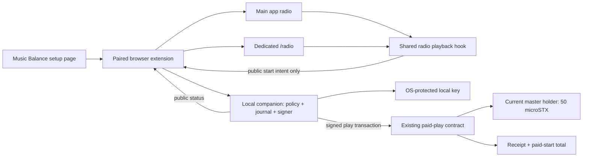

# Xtrata Music Balance: production integration plan

Status: proposed, 17 September 2026. Planning only; no production activation,
new wallet, signing or payments are authorised by this document.

## 1. Product decision

Use **Xtrata Music Balance** as the page/link name, **Music Wallet** for the
local account, and **Support as you listen** for the enabled mode. Suggested route:
`/music-balance`. This is prepaid optional support, not a monthly subscription,
access pass, renewal or platform-held balance. Unspent funds belong to the user.

Main message: “Add a little STX. Support songs as they start. Listening stays free.”
A user opts in once to automated per-start payments from their dedicated local
wallet. Thereafter it works in the main app radio and the standalone `/radio`
without approving individual transactions, as long as funds, signer and network
are available. Normal autoplay continues. Funding never draws automatically from
the user's ordinary wallet. There is no platform or treasury fee in this release.

The practical promise is **one transaction per eligible audible start while paid
mode is ready**, not guaranteed settlement of every click in every network state.
A network cannot promise immediate settlement, and the radio must never wait for
it. If payment cannot proceed safely, that start is free and visibly unrecorded
as a paid start. There is no later bill for missed starts.

## 2. What is already proven, and what is not

- Deployed `xtrata-radio-plays-v1-0`: atomic 50 microSTX holder transfer, paid-start
  counter and wallet-scoped 16-byte receipt. Explicit core identity, no admin.
- Mainnet test: four successful payments; three at 300 microSTX network fee and
  one at 257; each paid the holder 50. The 200-fee attempt returned HTTP 400 and
  stopped the runner. Do not advertise 200 as the paid-play production fee.
- Existing likes are separate wallet-signed on-chain endorsement transactions.
- Existing measured plays track duration/completion independently.
- The wizard is a single-operator test tool, not a production end-user service.
  Its co-located unlock key, process locks, fixed test caps and failure recovery
  are not sufficient for a public wallet rollout. Keep the test wallet isolated;
  never migrate its key, funds or journal into user installations.
- Four transactions do not prove cross-tab reliability, long-running autoplay,
  reboot recovery, withdrawals, broad browser support or production security.

## 3. Local signer architecture: preserve the user's backend requirement

Recommend a signed **desktop Music Wallet companion**, with a small browser
extension communicating through native messaging. Initial supported release:
macOS + desktop Chrome, matching our test environment. Windows and other desktop
browsers follow their own support tests; mobile users continue with free radio.
Do not claim desktop local-wallet support works on iOS/Android automatically.

Why a companion: a hosted page cannot spawn an arbitrary local backend, use the
OS keystore unattended, or discover a private wallet on another device. A browser
wallet could avoid installation but changes the requested security/operation
model. A cloud signer creates custody and service responsibilities. Neither is a
silent fallback.

Why native messaging for production: our current loopback panel cannot accept
commands from xtrata.xyz; it deliberately requires its own Origin. Public-web
requests to localhost also encounter browser Local Network Access permissions.
Do not fix that by enabling wildcard CORS or exposing a public signing endpoint.
A narrow paired extension/native bridge avoids dependence on localhost HTTP for
normal playback. Validate installation and connection UX before full build.

Each installation creates a fresh random key; no deterministic public secret,
embedded production key, or shared wizard account. Key generation, encryption,
signing and withdrawal approvals occur in the native process. Use OS-backed
secret storage, signed/notarized app distribution and a password-encrypted backup
verified before funding. Fail closed on insecure keystore fallback. Never send
key or backup plaintext through the website, extension, analytics or logs.

OS-protected storage enables “automatically available on this computer” after
initial approval. Computer locked, keystore denied, companion stopped or explicit
Lock means free playback until available again. Explain this during setup. A
local automatic signer is technically hot while available; do not call it cold.

## 4. Setup page and navigation

Add a normal **Music Balance** link beside radio/music navigation in the active
`index.html` homepage. Add the same link to `/radio`. No purchase modal on Play,
no required wallet connection, and no large promotional block in the player.

`/music-balance` is a single guided page whose cards progressively become a
management dashboard:

1. **Understand:** optional; real network fee plus 0.00005 STX to current master
   holder per eligible start; starts skipped after audio begins remain payable;
   data public. “Continue listening free” always available.
2. **Install and pair:** detect supported environment only after user interaction;
   install companion/extension, approve pairing with the exact production origin.
   No local-service probe or permission prompt for visitors who have not opted in.
3. **Create and recover:** companion creates wallet, exports encrypted backup and
   verifies restoration locally. Page receives public address and backup-ready
   state only. Never reuse the connected likes/funding wallet as signer.
4. **Fund:** mainnet address + copy + QR + optional reviewed transfer through the
   user's existing wallet. Amount is user-selected; default suggestion 1 STX,
   smaller amounts permitted. Funding network fee shown separately. Confirm from
   chain balance, never merely a wallet callback. Duplicate clicks cannot create
   duplicate funding requests. No automatic top-up.
5. **Enable once:** explicit native approval: “Automatically support eligible
   song starts on xtrata.xyz using this wallet until its usable balance runs out
   or I turn this off.” Show fixed fee, holder payment, total, reserve, supported
   origins and whether later top-ups resume automatically. Recommended default:
   approved top-ups resume under unchanged policy; an explicit pause stays paused.

When enabled, detection of confirmed funds activates the mode automatically.
There is no separate Enable click for each top-up or each visit. A stored setting
on the webpage alone can never authorise spending. The companion is authoritative.

Dashboard: confirmed balance; reserved/pending debit; usable balance; indicative
starts remaining; current policy; activity; top up; pause; lock; backup; withdraw;
unpair. Show exact balance only on the dashboard, not in public player telemetry.
Do not put unbounded signup/testing controls on the production page.

## 5. Shared radio integration and zero impact on free listeners

`src/home/radio.js` is the shared playback engine. It creates/selects audio,
restores tracks and feeds the standalone view through snapshots. Integrate here
once, not independently in homepage and `/radio` click handlers. Main app HTML
and `public/radio.html` render the same optional public status snapshot.

- Add a tiny optional capability stub; dynamically load payment integration only
  for a paired, opted-in installation. No seed libraries or chain polling for
  free users. Use an extension capability announcement, not scanning local ports.
- Register a best-effort asynchronous media observer. Payment errors cannot throw
  into selection, pause, next, preload or audio playback promises. Never await
  payment readiness before `player.play()`.
- First-party top-level homepage and `/radio` are in scope. The existing widget
  and full-page view within one document share one engine/payment lifecycle.
- Third-party iframes, externally hosted embeds and raw livestream connections
  remain free and cannot call the signer. First-party framed players are excluded
  initially too; explicit frame/top-level policy is tested.
- The connected personal wallet remains responsible for likes and optional
  reviewed funding. Switching/disconnecting that wallet does not switch the
  Music Wallet, reset paid receipts, alter liked songs or secretly disable support.

Status chip occupies a reserved small slot: “Free listening”, “Supporting songs”,
“Payment pending”, or “Free - top up / reconnect / payment needs attention”. For
nonparticipants retain the existing radio layout apart from the navigation link.
No error modal or automatic redirect. Text and accessible live status accompany
colour. Rate-limit notifications; a single persistent reason is enough.

## 6. What counts as a paid start

Create a public random playback ID and canonical `(network, core, masterId)`
before calling play. Capture immutable identity before asynchronous events: the
current normal selection assigns nowPlaying after play resolves, so it is unsafe
to infer payment identity from a late UI snapshot. Do not change ordinary counter
semantics to solve this financial identity requirement.

| Event | Paid action |
| --- | --- |
| First successful unmuted playback, volume above zero | One start intent |
| Prefetch, loading failure, blocked autoplay | None |
| Pause/resume, buffer recovery, seek, repeated playing event | Reuse ID; none extra |
| Starts muted then unmuted while playing | First audible start only |
| New song, deliberate replay, natural loop | New playback ID and start |
| Rapid skip after audible start | Prior eligible start remains payable |
| Reload/reconnect restoring same playback | Reuse backend receipt; never charge twice |
| Ambiguous restored identity | Free until next unambiguous track selection |
| Funding arrives halfway through a freely started song | Start support at next new start |
| Switching between two UI views of same playback | No new start |

Persist playback identity for restoration before starting; never persist a new
identity for a failed load as though payment happened. Handle native loop wraps
explicitly (ended does not necessarily fire); distinguish rewind/seek from wraps.
Free analytics, paid starts and likes stay separate fields and separate semantics.

## 7. Companion bridge and cross-tab coordination

Pairing requires a user gesture and native confirmation, binds exact HTTPS origin
and browser installation, and has revocation. Extension validates top-level tab,
origin, document instance and schema. Native host only accepts the installed
extension ID. Production excludes preview domains, wildcard subdomains, opaque
origins and arbitrary local pages. Inscribed HTML remains sandboxed and cannot
inherit extension privileges or invoke the bridge.

Expose only `status`, `acquirePlaybackLease`, `startIntent`, `releaseLease` and
`openDashboard`; funding/withdrawal/policy changes require native review. No
arbitrary signing API, caller-selected recipient, arbitrary contract/network,
nonce, serialized transaction or spending amount. Backend pins helper and verifies
source/config. Secret key never enters bridge messages. Public pairing identifiers
are not themselves spending credentials.

One installation-wide backend writer, durable SQLite transaction journal and
unique `(wallet, playbackId)` constraint. One automatic-support playback lease
per wallet prevents multiple tabs from silently draining one balance. Other tabs
play free with “Support active in another tab”; takeover is explicit. Heartbeats
use bounded leases; loss pauses new intents, not music. In-page widget and full
radio do not compete when they are the same engine instance. Browser restarts
reconcile backend journal before accepting new starts.

Origin restrictions do not make a compromised trusted site harmless. Treat start
intents as untrusted; independently validate master, frequency, policy and budget.
The backend cannot prove physical listening from browser messages. Explain that
this records paid starts, not certified listening. Review trusted-page CSP and
inscription isolation before production activation.

## 8. Policy, costs and balance exhaustion

Initial recommended fixed miner fee: **300 microSTX**, plus fixed holder payment
50, total **350 microSTX (0.00035 STX)**. Show tested 257 as evidence, not a universal
minimum guarantee. Obtain current relay/fee diagnostics but never silently exceed
the approved fixed fee. If that fee is unsuitable, continue free and request a
policy change on the dashboard. Low-fee experiments remain in canary only.

Usable = confirmed chain balance - locally reserved maximum debits - withdrawal
reserve. Use integer microSTX and atomic reservations. Determine reserve from a
protected withdrawal envelope/fee policy; 1000 microSTX is a provisional floor,
not a guaranteed withdrawal cost. Display leftover reserve/dust honestly.

Estimated starts = floor(usable / 350) under this fixed policy; no expiry or
promised monthly allowance. No hidden 0.1 STX deduction. When a new reservation
cannot fit, mark balance-low and continue free, then resume on next new start
following a confirmed top-up if support was left enabled.

Default authorisation is the user's usable prepaid balance until paused, not the
wizard's 5-test/0.01-STX caps. Optional daily spending limit belongs in advanced
controls and is enforced by the companion. Fee changes, new helpers, new payment
recipients/models and origins require new consent; an app update cannot silently
expand a saved policy. Top-ups do not override an explicit lock or pause.

## 9. Durable payment pipeline and failure recovery

At most one unresolved transaction at first release. A small unsigned queue can
hold at most three intents for 60 seconds while a normal confirmation completes;
reserve their full costs immediately. Expired/overflowed intents become free and
release reservations. No queue replay on a later visit or after funds return.
Queue pressure changes paid status only; it never delays or rejects audio.

State machine: observed -> reserved -> signed -> submitted/unknown -> confirmed,
confirmed-abort, definitely-rejected, expired-free or recovery-required. Persist
signed bytes, txid, nonce and policy snapshot atomically before broadcasting.
Public reports never include signed bytes. Retry only identical bytes after
read-only reconciliation, with bounded backoff and the original policy. Never
create a new receipt/nonce to escape uncertainty.

Reconciliation checks sender, txid, call arguments, master, receipt, fees, canonical
block and transfer event. Reorg handling reopens the original entry, not a new
payment. An included abort can spend its miner fee and must update accounting.
Resolve API inconsistencies conservatively without freezing the radio.

The present runner records a generic HTTP 400 and wedges its journal. Production
must preserve sanitised node reason codes, distinguish definite nonacceptance
from unknown outcomes, and prove nonce/receipt state before releasing reservations.
Do not broadly treat all 400/404 responses as permission to sign another payment.
The existing rejected test entry is a recovery fixture, not something to delete.

Pause cancels unsigned intents and future automatic signing. Signed-but-unsent
transactions remain quarantined for explicit recovery, because signed bytes may
still be executable. Submitted transactions may confirm. Restart/upgrade reconciles
first and requires a fresh active player lease; no daemon-generated synthetic starts.

## 10. Master resolution, compatibility and data

V1 supports verified direct masters in explicitly supported cores. Do not resolve
payments by song title, artist field, first dependency or fallback core search.
Album/edition pointers need a separately tested canonical-reference resolver with
cycle/ambiguity/content checks before payments are enabled for them. Unresolved,
unsupported, self-owned or escrow-held masters play free with a reason; the existing
contract rejects those payments. No new helper is needed for supported direct masters.

Do not conflate a holder with a copyright owner or always with the artist. The
contract pays the current standard-principal holder at execution, including after
a sale while a transaction is pending. It is not an artist-split contract.

Add an idempotent chain event index (txid + event index; canonicality tracked) for
paid starts and actual holder receipts. Reuse server-side Hiro authentication and
bounded cache; never accept browser-claimed paid totals. Catalogue fields:
measured plays, completed listens, on-chain likes, confirmed paid starts, confirmed
holder payments. Show freshness/unavailable state, never convert unavailable to 0.
Subscription wallet addresses are public on chain; avoid joining them to personal
likes wallets in telemetry. Installation secret backups are never uploaded.

## 11. Recovery and compatibility are launch requirements

- Native-reviewed withdrawal to a user-confirmed mainnet address, with fee preview,
  pending reconciliation and a recovery reserve. No automated sweep or refill.
- Verified encrypted backup export/import; one active device per key. Moving a
  wallet requires old signer shutdown and fresh pairing. For two devices recommend
  separate balances; detect foreign nonce use and pause support on conflicts.
- Clear uninstall guidance: withdraw or verify backup first. Updates preserve keys,
  journal, pairing and revocation state, and use signed distribution.
- Local signer unavailable, unsupported browser, mobile, denied permissions,
  offline chain, corrupt storage, low funds or paused mode all preserve free radio.
- No installation-dependent feature gating for normal playback, likes, catalogue,
  minting or connected-wallet workflows.

## 12. Implementation map and stages

Proposed new code (names may be refined during implementation):

| Area | Location / work |
| --- | --- |
| Navigation | `index.html`, `public/radio.html`; preserve layout |
| Setup/dashboard | `public/music-balance.html`, `src/music-balance/` |
| Shared start adapter | `src/home/radio.js`, new `src/lib/radio/paid-plays/` |
| Pure protocol/policy | reusable master ID, transaction, intent and public status schemas |
| Native companion | `tools/music-wallet/`: OS vault, SQLite queue, nonce owner, signer, policy, recovery |
| Browser bridge | `extensions/music-wallet/`: pairing and constrained native messaging |
| Public data | paid-start event index/API and catalogue integration under functions/radio |
| Tests | unit, simulated transactions, mocked native bridge, real radio Playwright fixtures |
| Operator tooling | existing wizard/canary retained independently; never user-wallet storage |

A. **Compatibility spike and security design:** signed native host + extension,
pairing, keystore restart behaviour, trusted origin restrictions and zero prompts
for free users. Confirm package/distribution plan before claiming public readiness.

B. **Shared protocol and recovery:** production policy, persistent idempotence,
master resolver, reserve/nonce accounting; recover definite rejection and unknown
submission fixtures. Add withdrawal/backup restoration before asking users to fund.

C. **Setup/dashboard:** native creation, backup verification, funding detection,
one-time opt-in and persistent mode. No paid radio hook active yet.

D. **One radio hook:** in-app and standalone using identical integration; mock all
payments through exhaustive media/reload/tab tests. No extra local permissions or
payment bundles for free users. Feature flag remains off.

E. **Own-wallet mainnet canary:** fresh disposable balances, separately bounded
authorization, long playlist, two-tab/reload/background/sleep tests, exhaustion,
confirmed top-up, failed-fee recovery, withdrawal and audited receipts. Never test
with users' existing funded music wallets. Existing initial tests are insufficient.

F. **Small opt-in rollout:** macOS/Chrome first; allowlist capability, staged flags,
rollback that stops new intents while retaining recovery tools. Only then expand
browser/OS coverage. Mobile is a separate delivery milestone.

## 13. Acceptance matrix and release gates

1. New visitor: identical free audio start latency/controls; zero signing, local
   discovery, wallet prompts or extra chain polling. Lazy stub performance measured.
2. Funded opted-in user: first eligible start produces one exact payment, both
   homepage and /radio; no per-song wallet popup. Correct master after fast skips.
3. Reload, repeated playing, buffer, pause/resume, seek and page handover cannot
   duplicate payment. Explicit replay and natural loop each produce a fresh start.
4. Native stop, keystore lock, companion crash, bridge denial, missing metadata,
   storage failure, offline API, slow confirmations and queue overflow never stop music.
5. Two tabs/instances cannot spend concurrently or duplicate one playback. Takeover
   is visible; stale leaders cannot retain signing rights.
6. Empty/insufficient balance plays free; confirmed top-up enables next start only;
   paused mode stays paused; no catch-up debit for prior free songs.
7. Crash injection around every journal/broadcast boundary preserves max debit,
   receipt identity and nonce. Duplicate relay cannot double-pay. Reorg and abort
   tests reconcile exact fees and ownership at execution.
8. Wrong network/core/contract/recipient, changed fee/policy, untrusted origin or
   subframe cannot request a payment. Key/backup/raw transaction absent from logs.
9. Verified backup restores the same address; withdrawal succeeds after safe queue
   resolution; losing/denying local state never traps the radio in paid-only mode.
10. All new receipts reconcile with chain counters and exact transfer events;
    ordinary metrics and on-chain likes remain unchanged.

Do not enable production until these gates pass. “Until balance runs out” means
usable balance after reserve and reservations, while the companion and chain are
available. It cannot mean guaranteed payment during failures without either
blocking music or creating later catch-up charges, both excluded by this design.

## References

- Internal evidence: `docs/radio/reports/2026-09-15-wizard.md` and JSON audit.
- Current engine: `src/home/radio.js`; normal selection and restore paths both
  call `playCounter.select` before audio playback; normal nowPlaying updates late.
- Current backend: `scripts/wizard/radio-plays-backend.mjs`, server and suite.
- Chrome Local Network Access: https://developer.chrome.com/release-notes/142
- Electron OS-protected storage: https://www.electronjs.org/docs/latest/api/safe-storage
  (macOS production app should be signed; Linux fallback must be checked).
- Native messaging implementation must be verified against browser documentation
  during the compatibility spike; this plan does not claim current cross-browser support.
